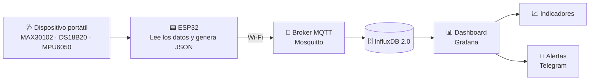

<div align="center">

# 🩺 Monitoreo de Salud para Adultos Mayores con IoT

### Dispositivo wearable de muñeca con sensores biomédicos, almacenamiento en la nube local y alertas en tiempo real


**Tecnológico de Monterrey** · Implementación del Internet de las cosas · Equipo 9

</div>

---

## 📋 Descripción

Este proyecto propone un sistema de **Internet de las Cosas (IoT)** para el cuidado de la salud de **adultos mayores**. Consiste en un dispositivo portátil, con forma de reloj o pulsera, que mide variables fisiológicas clave de la persona que lo porta.

Los datos se envían de forma inalámbrica a un servidor, donde se almacenan para consultar su historial y se muestran en un dashboard. Si algún valor sale del rango esperado, el sistema **envía una alerta** para avisar de un posible peligro.

## 🎯 Objetivo

Monitorear de forma continua el estado de salud de una persona mayor y detectar a tiempo situaciones de riesgo, mediante un dispositivo wearable de bajo costo, con registro histórico y alertas automáticas.

---

## 🧪 Variables biomédicas y sensores

El sistema adquiere **cuatro variables fisiológicas** mediante **tres sensores**:

| Variable | Descripción | Sensor |
|---|---|---|
| ❤️ Frecuencia cardíaca (BPM) | Ritmo cardíaco por minuto | **MAX30102** |
| 🩸 Saturación de oxígeno (%SpO₂) | Porcentaje de hemoglobina oxigenada en la sangre | **MAX30102** |
| 🌡️ Temperatura de la piel (°C) | Monitoreo térmico continuo para detectar fiebre o hipotermia | **DS18B20** |
| 😴 Calidad del sueño y movimiento | Actividad motora medida por aceleración durante el descanso | **MPU6050** |

---

## 🏗️ Arquitectura del sistema

El sistema se organiza en **cuatro capas**:

| Capa | Componente | Tecnología | Función |
|---|---|---|---|
| 1. Percepción | Sensores | MAX30102, DS18B20, MPU6050 | Obtienen SpO₂, frecuencia cardíaca, temperatura y movimiento durante el sueño |
| 2. Red | Microcontrolador y conexión | ESP32 + Wi-Fi + MQTT | Recibe los datos de los sensores, los organiza en **JSON** y los envía de forma inalámbrica |
| 3. Procesamiento | Broker y base de datos | Mosquitto + InfluxDB 2.0 | Mosquitto recibe los datos e InfluxDB los almacena para consultar el historial |
| 4. Aplicación | Dashboard y alertas | Grafana + Telegram | Visualiza las mediciones en tiempo real, muestra el historial y envía alertas fuera de rango |

### 🔄 Flujo de datos



---

## ⌚ Prototipo wearable

El dispositivo está pensado para colocarse **en la muñeca**, en forma de reloj o pulsera. Por ahora es un **prototipo sencillo**, con los componentes visibles para facilitar las pruebas y las conexiones.

- **ESP32:** se ubica en la parte principal del dispositivo.
- **MAX30102 y DS18B20:** deben estar en contacto con la piel para medir frecuencia cardíaca, SpO₂ y temperatura.
- **MPU6050:** va fijo dentro del reloj para registrar los movimientos relacionados con la calidad del sueño.
- **Cableado:** corto y ordenado.
- **Alimentación:** batería recargable **LiPo**, para uso portátil.

<!-- Cuando subas la imagen del prototipo a docs/img/, descomenta la siguiente línea -->
<!-- <p align="center"></p> -->

---

## 🧰 Tecnologías utilizadas

| Categoría | Tecnología |
|---|---|
| Hardware | ESP32, MAX30102, DS18B20, MPU6050, batería LiPo |
| Comunicación | Wi-Fi, MQTT, JSON |
| Broker | Eclipse Mosquitto |
| Base de datos | InfluxDB 2.0 |
| Visualización | Grafana |
| Alertas | Telegram |

---

## 📂 Estructura del repositorio

```
Reto-implementacion-de-internet/
├── README.md
└── Cierre_de_ETAPA_1_del_RETO.pdf
```
---

## 👥 Equipo 9

| Integrante | Matrícula |
|---|---|
| José Miguel Hernández Cruz | A01804683 |
| Ana Teresa Ordoñez Espinosa | A01798485 |
| Miguel Ángel Buendía | A01798876 |

**Profesor:** David Higuera Rosales
**Materia:** Implementación del Internet de las cosas
**Institución:** Tecnológico de Monterrey
